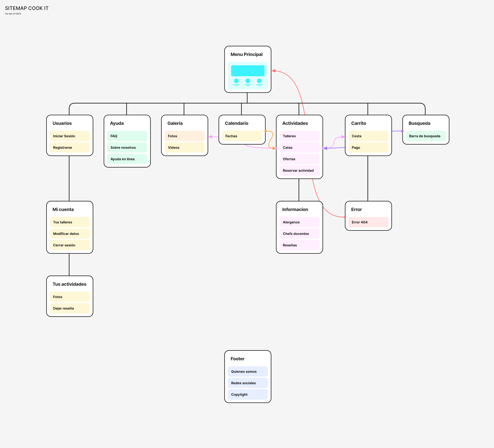

## DIU - Practica2, entregables

### Ideación 
* [Mapa de empatía](EmpathyMap.pdf)

A la hora de desarrollar nuestra propuesta a partir de la experiencia adquirida hemos decidido realizar un Empathy Map, el cual refleja el comportamiento de los  usuarios de la
práctica anterior.
  A la hora de desarrollar las necesidades de nuestros usuarios hemos seguido como plantilla la pirámide de necesidades de Maslow.

### PROPUESTA DE VALOR
* [ScopeCanvas](ScopeCanvas.png)

Nuestra empresa se va a llamar Cook it: Para desarrollar nuestra página hemos ideado una empresa especializada en cursos gastronómicos de todos tipos de culturas, tanto española como internacional, además de ofertar catas de comida para aquellas personas que no estén interesadas en cocinar ellos mismos esta comida. Además todas las personas que adquieran un producto recibirán en su cuenta personal una serie de fotos que se realizan en el curso para recordar la experiencia, estas fotos las realizan fotógrafos experimentados asociadas con nuestra empresa.

Nuestro propósito principal es el de impartir nuestra pasión por la cocina y proporcionar a cualquier persona con el deseo de  mejorar o aprender diferentes formas de cocinar comida sana y/o de diferentes culturas, además de promover la cocina típica de Granada y el turismo. Tambíen buscamos conectar a las personas con sus seres queridos, de forma que hay talleres que se realizan en parejas.

### TASK ANALYSIS

* [User Task Matrix](UserTaskMatrix.pdf)
* A la hora de ponderar las actividades que puede realizar el usuario hemos asignado un valor a cada importancia Alto = 3, Medio = 2 y Bajo = 1.

* User flow de la tarea ‘Uso de la sección de ayuda ‘:
* [User/Task flow1](UserFlow_AYUDA.png)
*  
* User flow de la tarea ‘ Crearse una cuenta‘:
* [User/Task flow2](UserFlow_CREARCUENTA.png)
*  
* User flow de la tarea ‘Ver horario’:
* [User/Task flow3](UserFlow_HORARIO.png)
* 
  

### ARQUITECTURA DE INFORMACIÓN

* [Sitemap](Sitemap.png)
 
* [Labelling](Labeling.pdf)

### Prototipo Lo-FI Wireframe

[Primer esbozo a papel:](Bocetos.pdf)

[Wireframe en figma:](BocetosFigma.png)

[Grid Layout con diseño RESPONSIVE](https://www.figma.com/file/yQqtolZnUfSgGdsxju0rNY/Responsive?type=design&node-id=0%3A1&mode=design&t=wBgLhXzqtOKZM0D3-1)

### Conclusiones  
Esta práctica nos ha permitido profundizar más en el desarrollo de interfaces de tal forma que el empathy map nos permite conocer más el punto de vista de los usuarios que van a utilizar nuestra página y van a adquirir nuestros productos.También hemos realizado nuestra propuesta de valor en la que establecemos sobre que vamos a desarrollar nuestro proyecto.

Hemos empezado a desarrollar nuestro proyecto que es una página dedicada a los talleres y catas gastronómicas, la cual hemos decidido llamar Cook it, nuestro principal propósito es el de acercar la gastronomia a todo tipo de personas y ayudarles a comer de forma más saludable y variada.

Con el task analysis mostramos todas las tareas que se pueden realizar en nuestra página, ordenadas de mayor a menor importancia, las 3 más importantes son: Ver horario, Adquirir Curso y Finalizar Compra.

Nuestro sitemap está dividido en Usuarios, Ayuda, Galería, Calendario, Actividades, Carrito y Búsqueda.

