# DIU - Practica 4, entregables

# 1- Asignación:

El caso asignado para nuestro A/B testing es una aplicación llamada [**SocialCooking**](https://github.com/dfp2500/DIU): una aplicación de reserva y gestión de cursos gastronómicos de diferentes culturas, 
en las que los usuarios dispondrán de perfiles personalizables a partir los cuales pueden compartir multimedia y comentarios de los talleres a los que han asistido, a forma de red social.

# 2- Roleplay: Users

  Nuestras personas ficticias para este A/B testing son:
  
| Usuarios | Sexo/Edad     | Ocupación   |  Exp.TIC    | Perfil Cubierto | Plataforma | TestA/B | Sus SCORE
| ------------- | -------- | ----------- | ----------- | -----------  | ---------- | ---- | -------
| #1 Manolo     | Hombre, 70   | Jubilado    | Baja       | Persona anciana, fan de la fotografía, que se siente feliz | Teléfono       | A | 72,5
| #2 Sara  | Mujer, 22   | Estudiante  | Alta       | Persona trabajadora, fan del estudio, que se siente triste | Teléfono        | A | 87,5
| #3 Toñi  | Mujer, 58   | Banquera     | Alta        | Persona minusválida, fan de los idiomas, que tiene miedo    | Teléfono      | B | 60
| #4 Paco  | Hombre, 35   | Empresario  | Media       | Persona familiar, fan de los deportes, que se siente sorprendido | Teléfono        | B | 52,5

Elección y características

* El primer usuario es **Manolo**, un hombre de 70 años que se encuentra jubilado, fan de la fotografía pasa sus tardes haciendo fotos a todo lo que le llama la atención, lo cual le hace sentir muy feliz y realizado. Accede a Cook it mediante un Teléfono, buscando adquirir un taller para una persona, la que le llama la atención que se hagan fotos en los talleres.

* La segunda usuario es **Sara**, una mujer de 22 años que estudia en Granada, es una persona muy trabajadora que dedica todas sus tardes a estudiar, algo que le apasiona, pero ultimamente se siente abrumada y triste, siente que se está distanciando de sus amigos. Accede a Cook it mediante un Teléfono, quiere adquirir una cata para 5 personas para pasar un buen tiempo con sus amigos y reconectar.

* La tercera usuario es **Toñi**, una mujer de 55 años que trabaja en un Banco, es fan de los idiomas y le encanta conocer a todo tipo de gente, a menudo siente miedo debido a que los sitios no suelen adaptarse a su minusvalía o no lo hacen correctamente ya que usa silla de ruedas. Accede a SocialCooking buscando reservar ocio adaptado a su condición y en el proceso conocer gente nueva.

* La cuarta persona es **Paco**, un hombre de 35 años que es un Empresario, es fan de los deportes, se siente sorprendido por la cantidad de talleres que ofrece SocialCooking de diferentes culturas. Accede a SocialCooking buscando reservar un taller para asistir junto con su familia y disfrutar de una nueva cultura culinaria.

# 3. Eye Tracking

Vamos a utilizar técnicas de benchmarking para evaluar el diseño de estas aplicaciones, en este caso usaremos Gaze Recorder. Hemos reclutado 4 personas que se asimilan de cierta forma a nuestros usuarios ficticios y les hemos pedido que accedan a los enlaces y realicen las siguientes actividades (teniendo en cuenta que son simulaciones y no aplicaciónes de uso totalmente funcional):

Actividades estudiadas en el eye tracking
**COOK IT**:
* Ver main page (observación) y reserva de taller:
  
  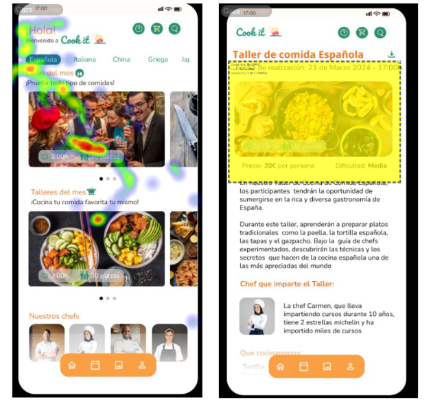
  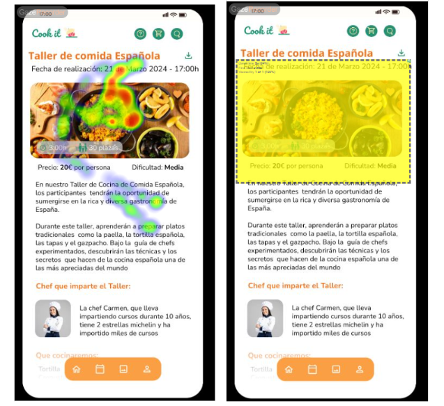
  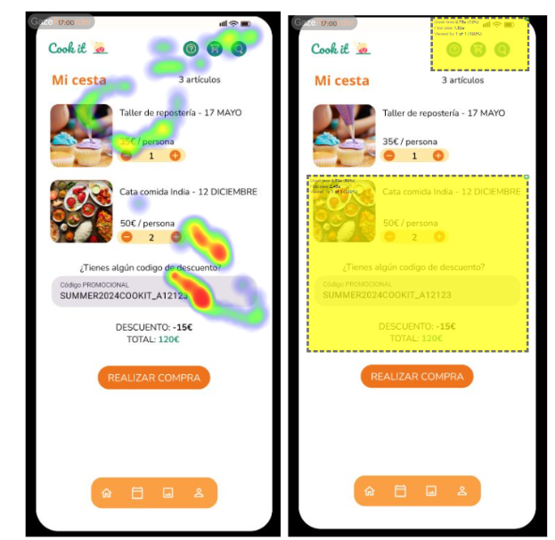
* Ver perfil y configurar cuenta:
  
  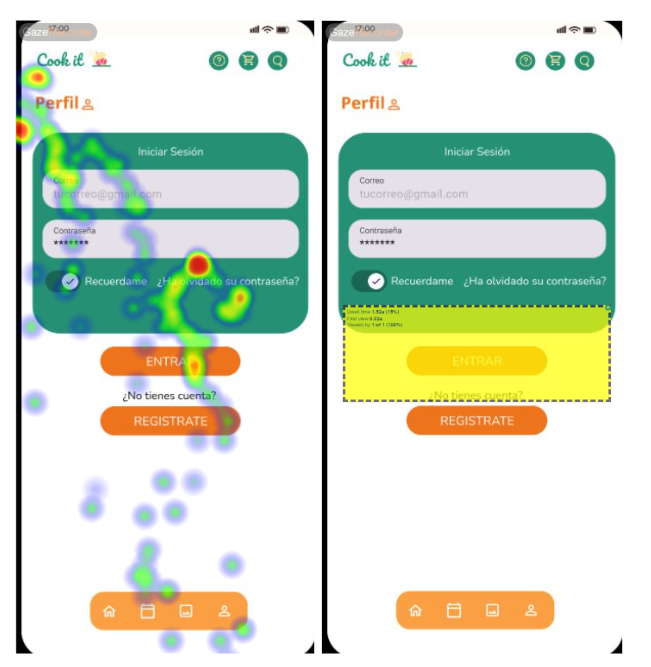
  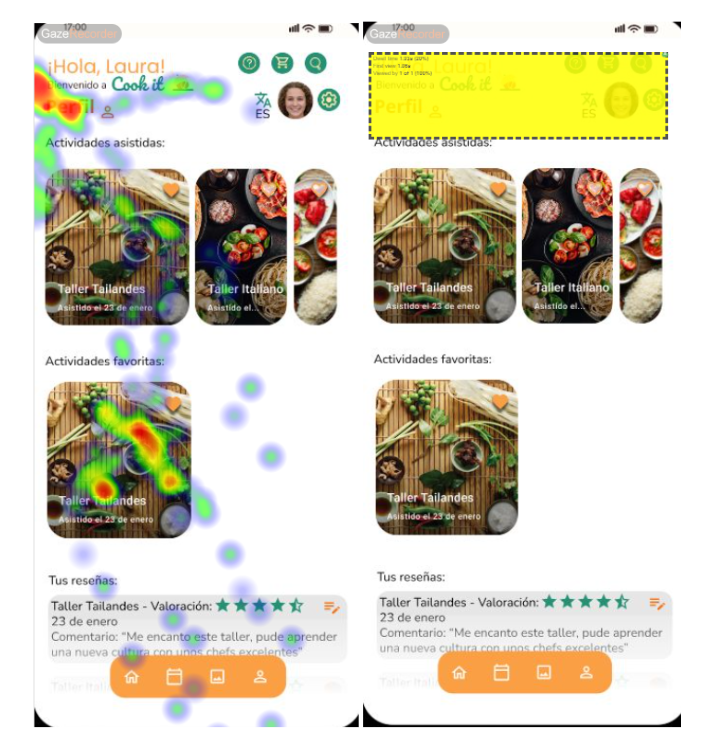
  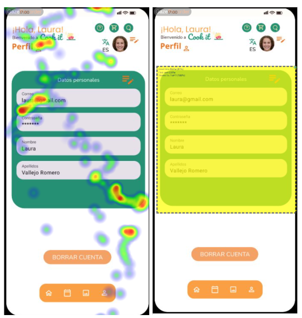

**SOCIAL COOKING**:
* Ver main page (observación) y reserva de taller:

  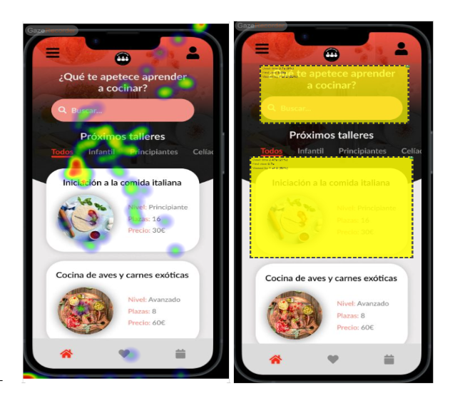
  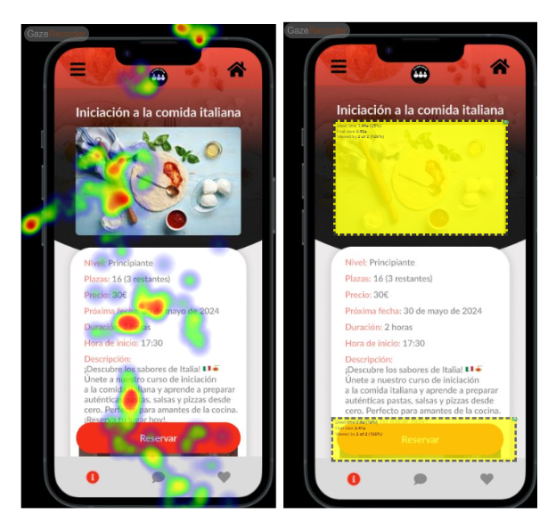
* Registrarse y ver perfil:

  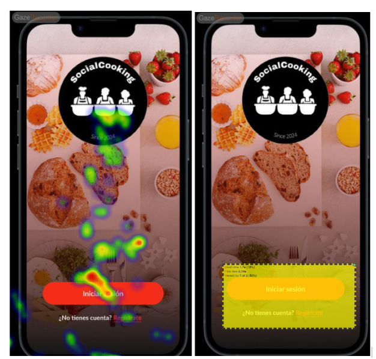
  
  
# 4. Cuestionario SUS:
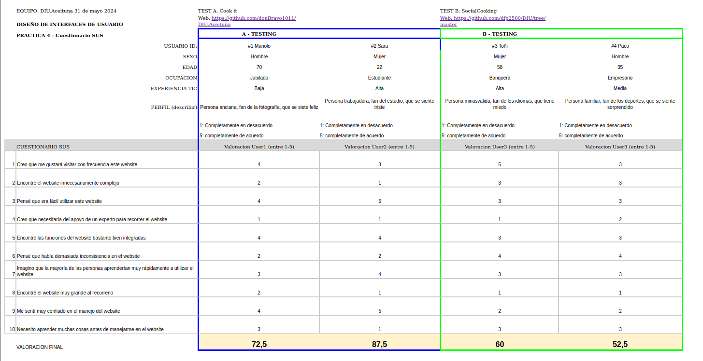
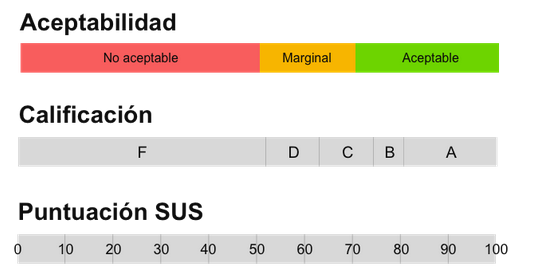

**Cook it**(Caso A) ha obtenido una puntuación de 72.5 para Manolo y 87.5 para Sara respectivamente. La valoración según el cuestionario SUS sería de "Aceptable tipo C" para la puntuación de 72.5 y “Aceptable Tipo B” para la puntuación de 87.5.

Creemos que esto se ve afectado sobre todo por la edad y los conocimientos tecnológicos, que pueden dificultar el uso de la aplicación y a la hora de visualizar y entender los iconos, que por su tamaño pueden ser más dificiles de ver y/o entender. 

**SocialCooking** (Caso B) ha obtenido una puntuación de 60 para Toñi y 52.5 para Paco respectivamente. La valoración según el cuestionario SUS sería de "Marginal tipo D" para la puntuación de 60 y “Marginal” para la puntuación de 50.

Creemos que esto se debe a la escasez de profundización a la hora de realizar la simulación de la aplicación, a pesar de que su estetíca es bonita y limpia, en el caso de Toñi se encontraba muy interesada en el aspecto de red social de la aplicación, pero solo está implementado que se pueda compartir tu propio perfil de forma que tendría que compartirlo a alguien entre sus contactos, ¿Como conoce a más gente que esté interesada en la cocina de esta forma?. 

En el caso de Paco, que tiene un menor conocimiento tecnológico, la aplicación no te muestra como llegar a la cesta, y los menús inferiores no con consistentes, cambiando según en la zona de la aplicación en la que te encuentres, lo cual dificulta y hace confuso el uso de esta misma.

# 5. Usability Report de Caso B:

Después de realizar las anteriores pruebas, hemos llegado a la siguentes conclusiones:

# Los puntos fuertes de SocialCooking son:

- Logo atractivo.
- Diseño sencillo y agradable, que llama la atención.
- Propuesta diferente que implementa una red social dentro de la venta de talleres de cocina.
- Perfil con grado de Experiencia(Nivel).
- Búsqueda en el inicio del Main Page, que facilita al usuario ir directo a lo que esté buscando de forma rápida sin perderse en la App.
- Paleta de alto contraste.
- Landing page atractivo y conciso que presenta la aplicación de forma rápida al usuario, incitandolo a descargarse la App.

# Puntos a mejorar:

- Profundizar más en el aspecto de Red Social, de forma que el usuario pueda acceder a los distintos perfiles desde la propia red social, ya sea mediante una función de busqueda o un timeline.
- El botom bar debería de ser estatíco, ya que puede confundir al usuario cuando intente encontrar algo que antes se mostraba en ella pero ha cambiado.
- Añadir un calendario funcional (Ya que hay un icono en main page pero no está implementado), que muestre los talleres que hay disponibles ese dia.
- Los usuarios tienen un Dato llamado Nivel, pero no se indica como puede aumentar de nivel un usuario, podría ir aumentando según el número de talleres que ha atendido y la dificultad de estos, lo cual fomentaria a los usuarios a adquirir más talleres.
- Que la simulación contenga algún tipo de scrolling.
- Que se permita dejar reseñas en los cursos que los usuarios ya hayan atendido.
- En la tabla de tareas se incluyen tareas como Ver historial, Cancelar reserva, Ver reserva, Unirse a la lista de espera, Consultar información de contacto, Eliminar cuenta pero ninguna de estas se ha implementado.
- No hay ninguna sección de ayuda en linea o FAQ.
- No hay información sobre donde se encuentra la empresa, este aspecto es muy importante para usuarios como Toñi, que necesitan saber si la zona donde transcurren los cursos es accesible.

**SocialCooking** es una aplicación con mucho potencial, que tiene una propuesta muy interesante a nivel de mercado, pero hace falta profundizar mas en la funcionalidad de la aplicación y su usabilidad, ya que no hemos sido capaces de analizarla del todo debido a esto, lo cual justifica su nota en el cuestionario SUS.

# 6. Conclusiones
