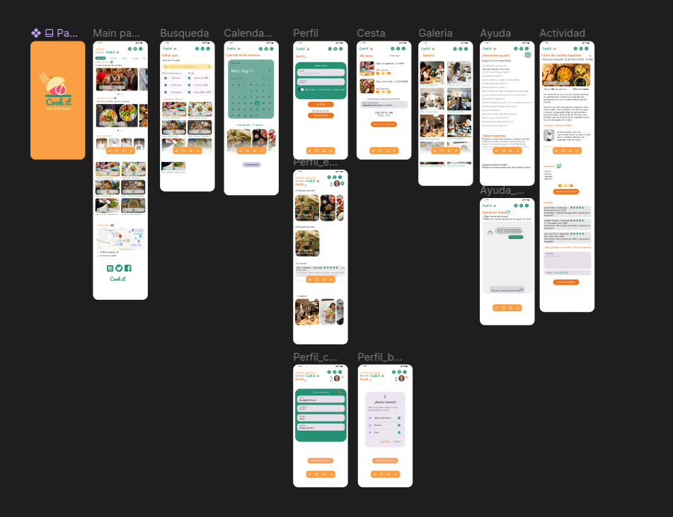
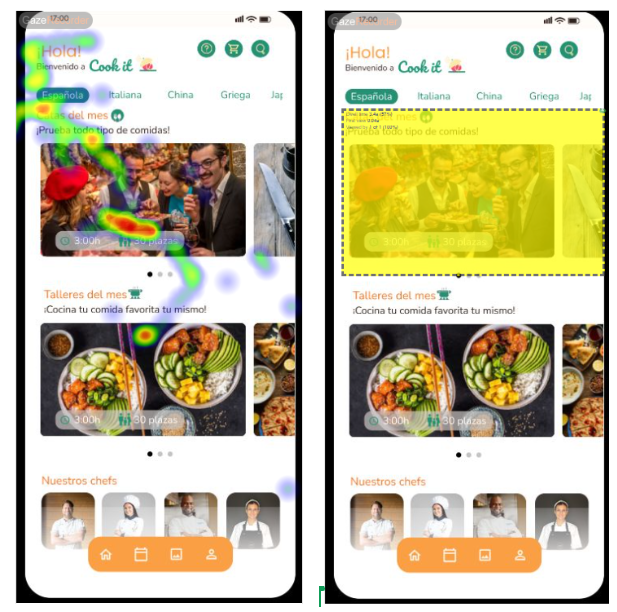
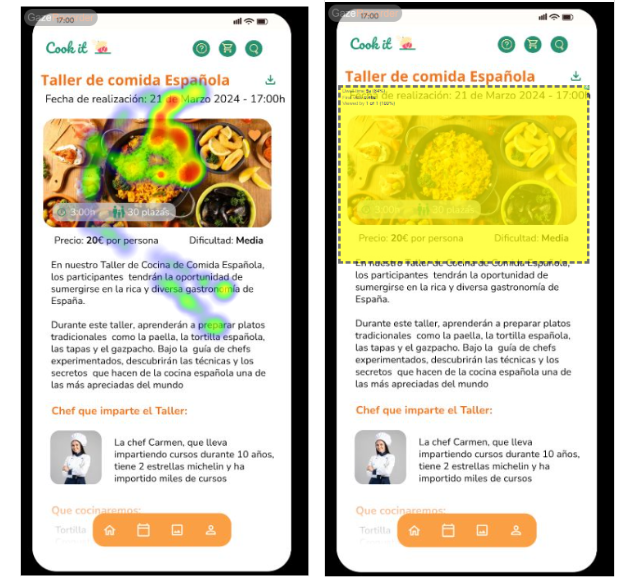
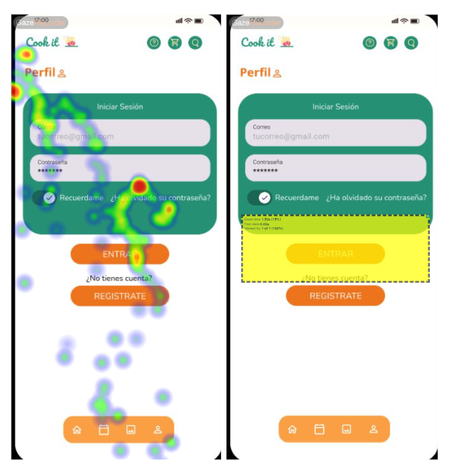
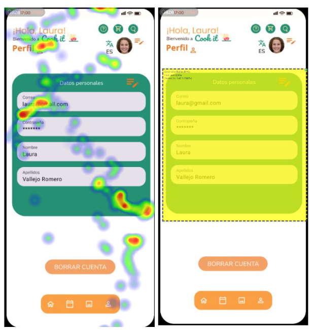
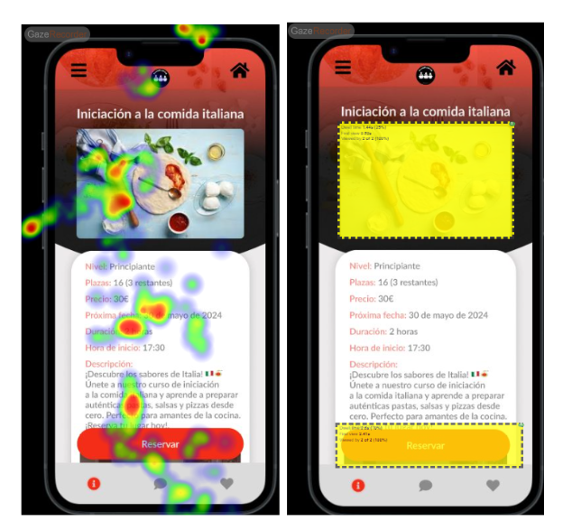
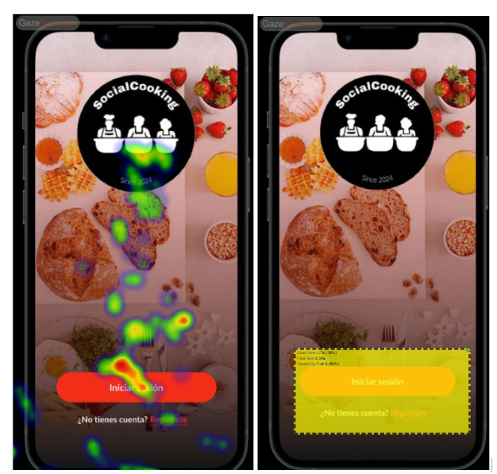
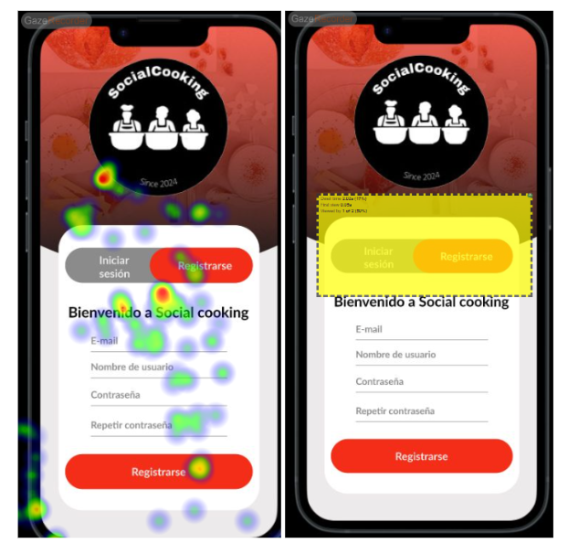
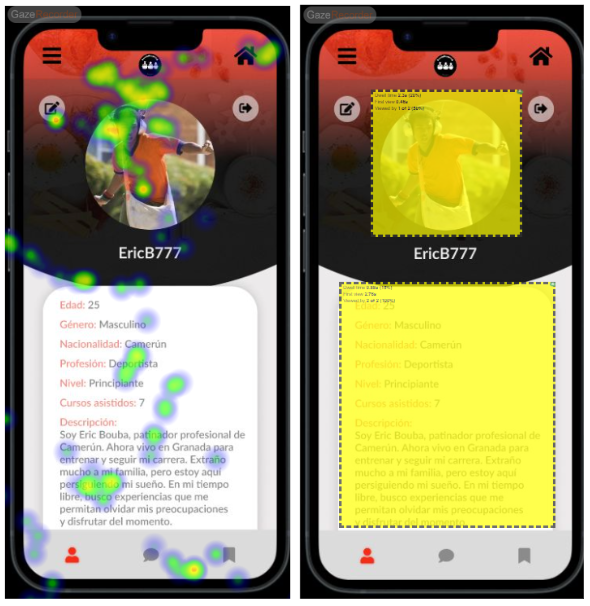
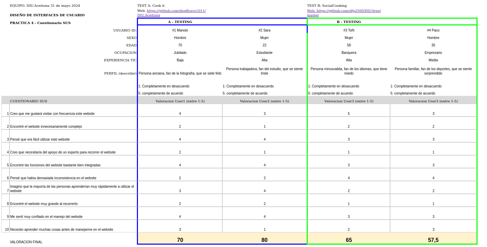

# DIU24
Prácticas Diseño Interfaces de Usuario 2023-24 (Tema: Talleres de Cocina) 

Grupo: DIU1_Aceituna.  Curso: 2023/24 
Updated: 18/5/2024

**Proyecto:** 
# COOK IT!

**Descripción:** 

**COOK IT!** es una aplicación diseñada para todos los amantes de la cocina, sin importar tu nivel de experiencia. Nuestra app ofrece una amplia gama de talleres y eventos gastronómicos, desde clases de cocina tradicional hasta catas de vinos que podrán adquirir en nuestra app. **COOK IT!** se enfoca en crear experiencias únicas que permitan a los usuarios explorar y aprender sobre la gastronomía de diversas culturas.

Buscamos fomentar una comunidad de usuarios comprometidos con la calidad y la autenticidad. Los usuarios pueden descubrir talleres impartidos por chefs locales y expertos gastronómicos, conectándose con personas que comparten su pasión por la gastronomía de calidad.

Nuestra misión es ofrecer una alternativa enriquecedora para aquellos que desean expandir sus conocimientos culinarios y disfrutar de experiencias gastronómicas auténticas, todo dentro de un entorno inclusivo y accesible para todos, de forma que la comida sana e internacional sea accesible a todo tipo de personas, la cual pueden distrutar en solitario o con sus seres queridos.

**Logotipo:** 

**Miembros**
 * :bust_in_silhouette: Miguel Bravo Campos [donBravo1011](https://github.com/donBravo1011)     
 * :bust_in_silhouette: Elena Vallejo Ruiz [elenavallejor](https://github.com/elenavallejor)

----- 

# Proceso de Diseño 

## Paso 1. UX User & Desk Research & Analisis 

En esta etapa hemos realizado un análisis de paginas webs relacionadas con talleres de cocina en Granada. Hemos analizado en profundidad diferentes aplicaciones y cómo nuestros perfiles ficticias las utilizarían.

 **1.a User Reseach Plan**
-----

Hemos realizado un análisis en profundidad de los posibles usuarios, las mejoras a realizar, las diferentes visiones que hay de un mismo producto y los tipos de investigación tanto cuantitativo como cualitativo y su aplicación en usuarios para obtener feedback. Hemos analizado en profundidad la página [Granada Cooking](https://granadacooking.com/).
[Puedes ver nuestro User Research aquí](P1/User-Research.pdf)

 1.b Competitive Analysis
-----

Vamos a realizar un analisis de la competencia existente: en cuanto a las aplicaciones asignadas tenemos [Pilsa Educa](https://pilsaeduca.com/) y [Granada Cooking](https://granadacooking.com/). Hemos elegido las dos para compararlas con un tercer competidor en el sector que es [ESPAI Granda](https://www.espaigranada.com/).

Nuestro [Competitive Analysis](P1/Competitor_Analysis.pdf)

Tras analizar 3 paginas web diseñadas por diferentes compañias hemos llegado a diferentes conclusiones con cada una de ellas. A la hora de analizar Granada Cooking nos hemos dado cuenta que no solo es importante el diseño de la pagina si no tambien su funcionalidad y facilidad de entendimiento hacia los usuarios ya que hay secciones que no funcionan: puede que los usuarios se vayan antes de realizar una compra, Pilsa Educa es una pagina muy completa la cual esta muy orientada a la venta de sus productos. Por ´hltimo encontramos Espai Granada la cual dispone de un sistema de ayuda en linea al momento pero carece de un registro de usuario, además de que sobrecarga al usuario con información.

 1.c Persona
-----

Nos hemos centrado en crear dos perfiles ordinarios (Pablo y Mari Carmen) los cuales por su entorno o aficiones (la cocina específicamente) podrían estar interesados en el mercado de Tours Gastronómicos en Granada y por tanto han acabado entrando en estas páginas web en busca de adquirir sus ofertas.

Tenemos a [Maria del Carmen](P1/Persona1_MCarmen.pdf) 

Tambien tenemos a [Pablo](P1/Persona2_Pablo.pdf) 

 1.d User Journey Map
----

Gracias al User Journey Map podemos valorar cómo se siente el usuario utilizando la aplicación en casos de uso habituales. Después de un análisis de los puntos débiles de la web hemos entrado en ellas con nuestras personas creadas y hemos intentado realizar una reserva de un taller como si estuviéramos en su piel. Hemos experimentado cada una de las dificultades que sentirán ellos y hemos propuesto algunas simples soluciones que arreglaran estos problemas.

Maria del Carmen quiere ir con su familia en su dia libre del trabajo a tener un buen rato memorable y busca reservar un curso. [Journey Map](P1/User_Journey_Map_MCarmen.pdf)

Pablo quiere regalarle a su novia por su aniversario una experiencia inolvidable y tambien va a realizar la adquisicion de un curso de cocina. [Journey Map](P1/User_Journey_Map_Pablo.pdf)

 1.e Usability Review
----
Hemos sometido la web de Granada Cooking a un Usability Review y dando puntuaciones a los diferentes aspectos de usabilidad, indicando algún comentario si esta lo necesitaba para aclarar el porqué de nuestra puntuación.
Nuestro Usability Review se puede ver [aqui](P1/Usability-review.pdf)

**La valoracion final:** 68 

**Comentarios:** La pagina web tiene un gran rendimiento y un diseño atractivo. Sin embargo, carece de ayuda para usuarios nuevos. Los usuarios deben de ser capaces de utilizar la aplicación con relativa facilidad para la mayoría de tareas fundamentales. Sin embargo, tareas como la busqueda de talleres, la seleccion de fechas en el calendario se hacen muy poco intuitivas y favorece a que los usuarios pierdan rapidamente el interes por la pagina.

## Paso 2. UX Design  

 2.a Reframing / IDEACION: Feedback Capture Grid / Empathy map 
----

Comentarios con un diagrama sobre los aspectos más destacados a modo de conclusión de la práctica anterior:

**Interesante**

La página tiene una estética agradable.
Los usuarios tienen expectativas positivas sobre la calidad y autenticidad de las clases y productos.
Hay confianza tras leer las reseñas de otros usuarios.

**Críticas**

Falta de información clara sobre los cursos disponibles.
Problemas con el calendario que causa confusión y retrasos.
La interfaz de usuario no resalta adecuadamente las opciones importantes como las fechas y horas disponibles.

**Preguntas**

¿Cómo podemos mejorar la visibilidad de los cursos disponibles?
¿Qué otras funcionalidades podríamos agregar para facilitar la navegación y reserva?

**Nuevas ideas**

Implementar un menú más intuitivo y tiempos de carga más rápidos.
Añadir una función que distinga claramente entre cursos disponibles y pasados.
Mejorar la función de búsqueda de la página web.
Ofrecer ayuda en línea 24/7.

A la hora de desarrollar nuestra propuesta a partir de la experiencia adquirida hemos decidido realizar un Empathy Map, el cual refleja el comportamiento de los usuarios de la práctica anterior. A la hora de desarrollar las necesidades de nuestros usuarios hemos seguido como plantilla la pirámide de necesidades de Maslow.
Nuestro [Empathy map](P2/EmpathyMap.pdf).

 2.b ScopeCanvas
----
Hacer el proceso de cocina saludable e internacional accesible a cualquier persona, conectar a la gente con sus seres queridos a traves de la cocina.
Derribar barreras que impiden a las personas disfrutar de una alimentacion saludable y diversa. Permitir a la gente mejorar su habilidad culinaria sin importar el nivel en el que inicien.

Esta es nuestra propuesta de valor: [Mas aqui](P2/ScopeCanvas.png)

 2.b User Flow (task) analysis 
-----

**User Map:** Es una técnica de diseño que representa visualmente las interacciones y el viaje de los usuarios a través de un producto o servicio. Incluye las acciones, emociones y pensamientos de los usuarios en cada punto de contacto con el sistema, ayudando a entender sus necesidades y comportamientos en diferentes etapas.

**Task Flow:** Técnica de diseño que define las tareas necesarias para que los usuarios alcancen sus objetivos. Muestra de manera visual las tareas que los usuarios deben realizar y las relaciones entre ellas, como la secuencia de pasos y los requisitos previos. Se utilizan diagramas para representar estos flujos, asegurando procesos intuitivos y eficientes.

[Nuestro User Task Matrix](P2/UserTaskMatrix.pdf)

**Hemos realizado 3 Task Flow:**

# 1-Ayuda en linea

# 2-Crear cuenta

# 3-Entrar en horarios

 2.c IA: Sitemap + Labelling 
----

En esta sección, se identifican y listan los términos clave que los usuarios emplean o esperan encontrar durante su interacción con nuestro sistema: la estructura y esqueleto de nuestra aplicación. Estos términos son fundamentales para asegurar una comunicación clara y efectiva, mejorando la usabilidad y la experiencia del usuario.

Nuestro [Sitemap](P2/Sitemap.png) y el [Labeling](P2/Labeling.pdf)

**Sitemap**

 2.d Wireframes
-----

Tenemos dos formas de mostrar los bocetos una es a papel que la podeis ver [aqui](P2/Bocetos.pdf).

Otra version de los bocetos la hemos hecho en [Figma](P2/BocetosFigma.png).

### Los bocetos muestran las siguiente actividades:

**-Pantalla de inicio**

**-Horario**

**-Adquirir curso**

**-Finalizar compra**

## Paso 3. Mi UX-Case Study (diseño)

 3.a Moodboard
-----

Para el moodboard hemos elegido unas fotos que nos inspiraban y nos transmiten sensaciones de familiaridad y cercania. Con esto hemos elegido una paleta de colores que permita a los usuarios encontrar el punto de asociar los colores a la comida, la naturaleza, sus propias experiencias. Hemos seleccionado dos fuentes que sean muy legibles y sencillas y seleccionado unos iconos para poder crear nuestros diseños. Además, hemos añadido unos comentarios que muestran cómo queremos que los usuarios nos identifiquen. [Nuestro Moodboard](P3/moodboard.png)

Nuestro logo es:

Despues de probarlo en varias redes sociales podemos confirmar que se puede utilizar como foto de perfil de muchas de ellas y encajaria de forma correcto. Lo que hace que con un logo tan minimalista y llamativo creariamos una marca bien definida y fácil de reconocer.

  3.b Landing Page
----

Nuestro landing page esta diseñado para captar la atencion de los posibles clientes de forma muy rapida y mostrarles de forma casi instantanea los servicios que ofrecemos para que no tenga que ir buscando por todo el landing page cada dato por separado. Finalmente en la parte final encontramos los enlaces a nuestra aplicacion desde las principales tiendas de aplicaciones. [Landing Page](P3/LANDINGPAGE_COOKIT.png)

 3.c Guidelines
----

Hemos seleccionado la fuente Nunito para nuestro proyecto debido a su legibilidad optimizada en pantallas digitales y su capacidad para mantener la coherencia visual conforme a los estándares de Google Material Design. La paleta de colores, compuesta por tonos naranja y verde, fue elegida estratégicamente para evocar frescura, vitalidad y una conexión visual con la cocina y los alimentos. Además, los iconos seleccionados complementan nuestra paleta de colores y estilo general, proporcionando una interfaz intuitiva y atractiva. Finalmente, hemos implementado diversos patrones de diseño de interfaz de usuario, como barras de navegación, botones, carruseles y campos de texto, para mejorar la usabilidad y la experiencia del usuario.[Guidelines](P3/GUIDELINES.pdf)

  3.d Mockup
----

**Se han elaborado las pantallas principales que permiten ver cómo se interactuaría con la app:**

-Main Page

-Busqueda

-Calendario

-Perfil

-Dentro del Perfil

-Cesta

-Galeria

-Ayuda

-Actividad

Se pueden encontrar por separado [aqui](https://www.figma.com/design/woG6kRfOjDU3rcbzs68iTO/APLICACION-COOKIT?node-id=0%3A1&t=fm5Lm63HSaQCUMCi-1).

Tambien se pueden ver de forma interactiva [aqui](https://www.figma.com/proto/woG6kRfOjDU3rcbzs68iTO/APLICACION-COOKIT?node-id=12-2886&t=oyrZY8wBJfQfFISE-1&scaling=min-zoom&page-id=0%3A1&starting-point-node-id=45%3A608).

Por ultimo hemos añadido un video para que sea mas intuitivo para nuevos usuarios el uso de nuestra aplicacion lo pueden ver [aqui](P3/video.mp4).

https://github.com/donBravo1011/DIU.Aceituna/assets/127402143/894979e4-77aa-4d45-98e7-ebe89bcf6dda

 3.e ¿My UX-Case Study?
-----

### Inspiración
Cook It surge a raíz de querer ofrecer, tanto a los usuarios que disfrutan de nuestros talleres de cocina como a usuarios externos, nuevas experiencias culinarias y conocimientos gastronómicos que podrán adquirir gracias a este nuevo enfoque. Al permitir el acceso a usuarios externos a la web de Cook It, se realiza una publicidad indirecta de nuestros servicios, atrayendo a más personas interesadas en la cocina. Al inicio, nos encontramos con las experiencias de María del Carmen y Pablo, personas apasionadas por la cocina y deseosas de aprender nuevas técnicas y recetas.

### Inicio del Proyecto
Estas dos personas, María del Carmen y Pablo, junto a nosotros, generamos diferentes ideas que, con la ayuda de herramientas como la malla receptora y el scope canvas, nos permitieron desarrollar un diseño propio. Lo primero que hicimos fue crear unos bocetos a mano alzada, esbozando nuestras primeras ideas para la extensión web de Cook It.

### Diseño
Con las ideas más claras y la estructura y funcionalidades de la web definidas, comenzamos a dotar de personalidad al proyecto mediante un moodboard que recogiese todos los elementos que queríamos reflejar en nuestro proyecto, dotando a nuestra web de una identidad única. Este moodboard incluye imágenes, tipografías y otros elementos visuales. El siguiente paso fue diseñar una landing page que atrajera a clientes potenciales, haciendo de esta página un sitio sencillo y fácil de leer, dando mucha importancia al componente visual. Por último, antes de darle la apariencia final con Protopie a la aplicación, analizamos patrones de diseño que se ajustaran a las necesidades de los usuarios.

### Conclusión
Tras crear personajes de usuario, específicamente María del Carmen y Pablo, y usarnos a nosotros mismos también como inspiración, hemos sido capaces de desarrollar un prototipo fiel de lo que sería nuestra webApp para Cook It. Gracias a esta actividad, hemos aprendido a crear un diseño y un estilo que refleje la identidad de nuestro proyecto, utilizando técnicas de branding y diseño. Hemos conseguido crear una webApp adaptada a los usuarios que cubre sus necesidades básicas y mejora su experiencia en nuestros talleres de cocina.

## Paso 5. Exportación & evaluación con Eye Tracking 
-----

)  5.b Eye Tracking method 

Vamos a utilizar técnicas de benchmarking para evaluar el diseño de estas aplicaciones, en este caso usaremos Gaze Recorder. Hemos reclutado 4 personas que se asimilan de cierta forma a nuestros usuarios ficticios y les hemos pedido que accedan a los enlaces y realicen las siguientes actividades (teniendo en cuenta que son simulaciones y no aplicaciónes de uso totalmente funcional). Para realizar el Eye Tracking se utilizaban las fotografias que procedian con la accion a realizar(Entre 2 y 3 por accion) y un intervalo de 6 segundos entre cada fotografia:

Actividades estudiadas en el eye tracking
**COOK IT**:
* Ver main page (observación) y reserva de taller:

   **Los usuario se centran sobretodo en la primera imagen de la aplicacion.**

   

   **Igualmente que en la anterior se puede ver como la foto es lo mas llamativo.**

   

   **En la cesta se puede ver como ha diferencia de las imagenes aqui se centran en el precido y los descuentos.**

   
* Ver perfil y configurar cuenta:

  **Como es de esperar los usuarios se centra en los campos que tienen que rellenar.**

   

   **Los usuarios perciben los cambios de la pagina principal con sus datos personales.**

   

   **Analogamente, siguen centrandose en los campos de su perfil.**

   

**SOCIAL COOKING**:
* Ver main page (observación) y reserva de taller:

   **Los usuarios se centran en la primera imagen y en el menu de navegacion de la aplicacion.**

   

  **En este caso se puede ver como resalta mucho el boton de reservar y los usuarios leen las caraceristicas del taller.**

  
* Registrarse y ver perfil:

   **El boton de iniciar es lo que mas resalta con diferencia, ya que le da al usuario un camino el cual seguir.**

  

   **Los colores fuertes como el rojo son los mas llamativos para el usuario.**

   

  **En el perfil lo que mas destaca son sus campos y su fotografia de perfil.**

   

Diseño del experimento 
----

>> Uso de imágenes (preferentemente) -> hay que esablecer una duración de visualización y  
>> fijar las áreas de interes (AoI) antes del diseño. Planificar qué tarea debe hacer el usuario (buscar, comprar...) 

  
>> cambiar img por tu diseño de experimento  

>> Recordar que gazerecorder es una versión de pruebas: usar sólo con 3 usuarios para generar mapa de calor (recordar que crédito > 0 para que funcione) 

Resultados y valoración 
-----

>> Cambiar por tus resultados
  

## Paso 4. Evaluación 

 4.a Caso asignado
----

El caso asignado para nuestro A/B testing es una aplicación llamada [**SocialCooking**](https://github.com/dfp2500/DIU): una aplicación de reserva y gestión de cursos gastronómicos de diferentes culturas, 
en las que los usuarios dispondrán de perfiles personalizables a partir los cuales pueden compartir multimedia y comentarios de los talleres a los que han asistido, a forma de red social.

 4.b User Testing
----

Nuestras personas ficticias para este A/B testing son:
  
| Usuarios | Sexo/Edad     | Ocupación   |  Exp.TIC    | Perfil Cubierto | Plataforma | TestA/B | Sus SCORE
| ------------- | -------- | ----------- | ----------- | -----------  | ---------- | ---- | -------
| #1 Manolo     | Hombre, 70   | Jubilado    | Baja       | Persona anciana, fan de la fotografía, que se siente feliz | Teléfono       | A | 72,5
| #2 Sara  | Mujer, 22   | Estudiante  | Alta       | Persona trabajadora, fan del estudio, que se siente triste | Teléfono        | A | 87,5
| #3 Toñi  | Mujer, 58   | Banquera     | Alta        | Persona minusválida, fan de los idiomas, que tiene miedo    | Teléfono      | B | 60
| #4 Paco  | Hombre, 35   | Empresario  | Media       | Persona familiar, fan de los deportes, que se siente sorprendido | Teléfono        | B | 52,5

Elección y características

* El primer usuario es **Manolo**, un hombre de 70 años que se encuentra jubilado, fan de la fotografía pasa sus tardes haciendo fotos a todo lo que le llama la atención, lo cual le hace sentir muy feliz y realizado. Accede a Cook it mediante un Teléfono, buscando adquirir un taller para una persona, la que le llama la atención que se hagan fotos en los talleres.

* El segundo usuario es **Sara**, una mujer de 22 años que estudia en Granada, es una persona muy trabajadora que dedica todas sus tardes a estudiar, algo que le apasiona, pero ultimamente se siente abrumada y triste, siente que se está distanciando de sus amigos. Accede a Cook it mediante un Teléfono, quiere adquirir una cata para 5 personas para pasar un buen tiempo con sus amigos y reconectar.

* El tercer usuario es **Toñi**, una mujer de 55 años que trabaja en un Banco, es fan de los idiomas y le encanta conocer a todo tipo de gente, a menudo siente miedo debido a que los sitios no suelen adaptarse a su minusvalía o no lo hacen correctamente ya que usa silla de ruedas. Accede a SocialCooking buscando reservar ocio adaptado a su condición y en el proceso conocer gente nueva.

* El cuarto usuario es **Paco**, un hombre de 35 años que es un Empresario, es fan de los deportes, se siente sorprendido por la cantidad de talleres que ofrece SocialCooking de diferentes culturas. Accede a SocialCooking buscando reservar un taller para asistir junto con su familia y disfrutar de una nueva cultura culinaria.

 4.c Cuestionario SUS
----

Usaremos el **Cuestionario SUS** para valorar la satisfacción de cada usuario con el diseño (A/B) realizado. Para ello usamos la [hoja de cálculo](https://github.com/mgea/DIU19/blob/master/Cuestionario%20SUS%20DIU.xlsx) 

**Cook it**(Caso A) ha obtenido una puntuación de 72.5 para Manolo y 87.5 para Sara respectivamente. La valoración según el cuestionario SUS sería de "Aceptable tipo C" para la puntuación de 72.5 y “Aceptable Tipo B” para la puntuación de 87.5.

Creemos que esto se ve afectado sobre todo por la edad y los conocimientos tecnológicos, que pueden dificultar el uso de la aplicación y a la hora de visualizar y entender los iconos, que por su tamaño pueden ser más dificiles de ver y/o entender. 

**SocialCooking** (Caso B) ha obtenido una puntuación de 60 para Toñi y 52.5 para Paco respectivamente. La valoración según el cuestionario SUS sería de "Marginal tipo D" para la puntuación de 60 y “Marginal” para la puntuación de 50.

Creemos que esto se debe a la escasez de profundización a la hora de realizar la simulación de la aplicación, a pesar de que su estetíca es bonita y limpia, en el caso de Toñi se encontraba muy interesada en el aspecto de red social de la aplicación, pero solo está implementado que se pueda compartir tu propio perfil de forma que tendría que compartirlo a alguien entre sus contactos, ¿Como conoce a más gente que esté interesada en la cocina de esta forma?. 

En el caso de Paco, que tiene un menor conocimiento tecnológico, la aplicación no te muestra como llegar a la cesta, y los menús inferiores no con consistentes, cambiando según en la zona de la aplicación en la que te encuentres, lo cual dificulta y hace confuso el uso de esta misma.

 4.d Usability Report
----

Después de realizar las anteriores pruebas, hemos llegado a la siguentes conclusiones:

# Los puntos fuertes de SocialCooking son:

- Logo atractivo.
- Diseño sencillo y agradable, que llama la atención.
- Fuente legible, que combina con la elección estetica para la aplicación.
- Eslogan llamativo.
- Iconos sencillos y legibles, que contrastan con los colores utilizados.
- Propuesta diferente que implementa una red social dentro de la venta de talleres de cocina.
- Perfil con grado de Experiencia(Nivel).
- Búsqueda en el inicio del Main Page, que facilita al usuario ir directo a lo que esté buscando de forma rápida sin perderse en la App.
- Paleta de alto contraste, que utiliza colores vibrantes.
- Landing page atractivo y conciso que presenta la aplicación de forma rápida al usuario, incitandolo a descargarse la App.

# Puntos a mejorar:

- Profundizar más en el aspecto de Red Social, de forma que el usuario pueda acceder a los distintos perfiles desde la propia red social, ya sea mediante una función de busqueda o un timeline.
- El botom bar debería de ser estatíco, ya que puede confundir al usuario cuando intente encontrar algo que antes se mostraba en ella pero ha cambiado.
- Añadir un calendario funcional (Ya que hay un icono en main page pero no está implementado), que muestre los talleres que hay disponibles ese dia.
- Los usuarios tienen un Dato llamado Nivel, pero no se indica como puede aumentar de nivel un usuario, podría ir aumentando según el número de talleres que ha atendido y la dificultad de estos, lo cual fomentaria a los usuarios a adquirir más talleres.
- Que la simulación contenga algún tipo de scrolling, para añadir profundidad a la aplicación.
- Que se permita dejar reseñas en los cursos que los usuarios ya hayan atendido, para que otros usuarios que no han atendido el curso tengan algún respaldo para realizar la decisión de compra.
- No hay ninguna sección de ayuda en linea o FAQ, lo cual permite a los usuarios eliminar sus dudas.
- No hay información sobre donde se encuentra la empresa, este aspecto es muy importante para usuarios como Toñi, que necesitan saber si la zona donde transcurren los cursos es accesible.
- Hay un sidebar pero no sabemos que puede contener.

**SocialCooking** es una aplicación con mucho potencial, que tiene una propuesta muy interesante a nivel de mercado, pero hace falta profundizar mas en la funcionalidad de la aplicación y su usabilidad, ya que no hemos sido capaces de analizarla del todo debido a esto, lo cual justifica su nota en el cuestionario SUS.

5.) Conclusion de EVALUACION (A/B testing + usability report + eye tracking) 
----

>> recupera el usability report de tu práctica (que es el caso B de los asignados a otros grupos) 
>> con los resultados del A/B testing, de eye tracking y del usability report:
>>  comentad en 2-3 parrafos cual es la conclusion acerca de la realización de la práctica y su evaluación con esas técnicas y que habéis aprendido

## Conclusión final / Valoración de las prácticas

Gracias al desarrollo de estas prácticas de Diseño de Interfaces de Usuario nos hemos dado cuenta de la importancia que tiene la experiencia del usuario y la accesibilidad de nuestras páginas webs y aplicaciones moviles. A veces como programadores suponemos que todo el mundo entiende nuestros diseños al haberlos creado nosotros desde cero y entendemos su funcionabilidad al completo, pero no es así. Estas prácticas nos serán muy utiles para el futuro :)

